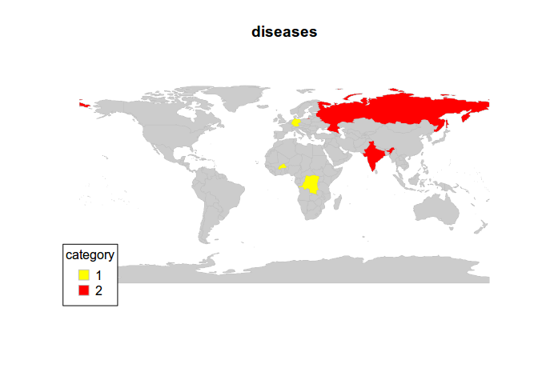

Creating colour coded maps in R

    library(rworldmap)

    ## Loading required package: sp
    ## ### Welcome to rworldmap ###
    ## For a short introduction type :   vignette('rworldmap')

    theCountries <- c("DEU", "COD", "BFA")
    # These are the ISO3 names of the countries you'd like to plot in red

    malDF <- data.frame(country = c("DEU", "COD", "BFA", "IND", "RUS"),
      diseases = c(1, 1, 1, 2, 2) )
    # malDF is a data.frame with the ISO3 country names plus a variable to
    # merge to the map data

    malMap <- joinCountryData2Map(malDF, joinCode = "ISO3",
      nameJoinColumn = "country")

    ## 5 codes from your data successfully matched countries in the map
    ## 0 codes from your data failed to match with a country code in the map
    ## 239 codes from the map weren't represented in your data

    # This will join your malDF data.frame to the country map data

    mapCountryData(malMap, nameColumnToPlot="diseases", catMethod = "categorical",
      missingCountryCol = gray(.8))

    # And this will plot it, with the trick that the color palette's first
    # color is red
